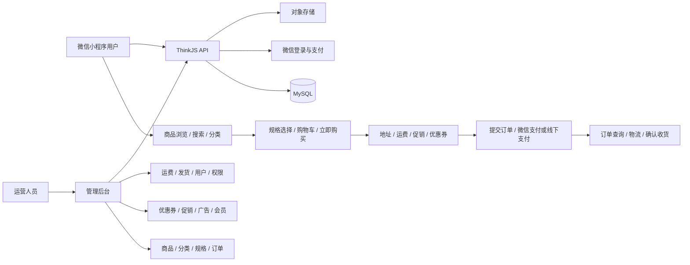

# HioShop AI 辅助电商系统实践

> 基于开源 HioShop 的微信电商系统二次开发、质量治理与工程交付实践

这是一个用于统一编排微信小程序、运营管理后台、Node.js 服务端、自动化测试与部署配置的项目仓库。项目以 HioShop / NideShop 开源体系为基础，重点记录如何借助 AI Coding 完成存量系统理解、跨端功能迭代、风险排查、测试建设与部署验证。

本仓库适合作为产品经理求职作品集中的技术实践案例：它展示的不是“从零独立原创一套商城”，而是基于真实开源系统进行需求梳理、方案拆解、跨端协同和交付闭环建设的过程。

## 项目定位

- **项目类型：** 微信电商系统二次开发与工程化实践
- **角色视角：** 产品需求分析、方案拆解、AI 辅助开发、联调验证与发布管理
- **基础项目：** [HioShop](https://github.com/iamdarcy/hioshop-server)（其服务端说明亦注明基于 NideShop 重建）
- **仓库形态：** 根仓库负责版本编排、测试、部署和交付记录；三个业务端以 Git 子模块接入
- **当前范围：** 小程序端、管理后台、服务端 API、MySQL、自动化测试、CI/CD 与 Docker 部署

## 业务全景



已在代码或测试矩阵中识别并覆盖的主要业务域包括：

- 商品、分类、搜索、规格与价格展示
- 购物车、地址、运费、结算与订单提交
- 微信预支付、支付回调、重复通知幂等与订单状态流转
- 优惠券领取/锁定/使用/释放，以及促销优惠计算
- 拼团、会员、邀请、足迹和广告消息
- 后台商品与批量导入、订单发货、物流、用户与角色权限
- 后台配置到小程序展示/使用的跨端一致性验证

## 产品能力与实践重点

### 1. 从需求到跨端落地

同一项业务能力通常需要同时处理小程序交互、服务端规则、后台配置和数据结构。例如优惠券链路包含后台配置、小程序领取、结算页试算、下单锁定、支付后核销及失败释放；测试矩阵为这些跨端状态建立了明确场景。

### 2. 存量产品体验治理

实践包含登录资料补全与 `412` 门禁联动、分类页滚动隔离、请求层异常处理、订单列表分页、结算与支付容错、商品价格展示等改进。部分新能力通过配置开关控制，便于灰度验证和回退。

### 3. 风险驱动的优先级管理

仓库保留了依赖风险、代码审查、P0/P1 修复和验证记录。处理方式不是机械追逐版本，而是结合调用可达性、业务影响和回归成本确定优先级，并为发布保留检查清单与回滚方案。

### 4. AI Coding 协作方式

AI 在本项目中作为开发与分析助手，参与：

- 阅读存量代码并梳理模块、接口和依赖关系
- 将产品目标拆分为小程序、后台、服务端和数据库改动
- 辅助生成或修改代码、迁移脚本、测试脚本和部署文档
- 对鉴权、支付幂等、上传、依赖和异常处理进行风险检查
- 运行编译、Lint、构建、接口/业务回归，并根据结果迭代

AI 输出不被直接视为完成结果；代码、报告和发布结论仍通过自动化门禁、人工审查及必要的真机/真实环境验证来确认。

## 系统组成

| 模块 | 当前技术栈 | 主要职责 |
| --- | --- | --- |
| `hioshop-miniprogram` | 微信原生小程序、JavaScript、WXML/WXSS、Vant Weapp | 用户端浏览、购物车、结算、支付、订单、地址、优惠券、拼团、会员等 |
| `hioshop-admin-web` | Vue 3、Vite、Element Plus、Pinia/Vuex、Axios、Vitest | 商品、分类、订单、物流、促销、优惠券、会员、广告、用户与权限运营 |
| `hioshop-server` | Node.js 20+、ThinkJS、MySQL、JWT、AWS S3 SDK（兼容对象存储） | 小程序与后台 API、业务规则、鉴权、支付、上传及数据访问 |
| `testing` | Python 3.11、Requests/PyMySQL、Node.js 脚本 | 合约、业务、跨端、前端冒烟、安全与并发验证 |
| `deploy` | Docker Compose、Caddy、Shell、GitHub Actions | MySQL/API/后台容器编排、HTTPS 入口、迁移、部署与回滚 |

> 说明：三个业务目录是 Git 子模块。上表依据根仓库当前锁定的子模块提交及其 `package.json`、页面、控制器和脚本核验，不沿用子项目旧 README 中已经过时的 Vue 2 等描述。

## 仓库结构

```text
.
├── .github/workflows/
│   ├── ci.yml                 # 三端检查 + PR 业务门禁
│   ├── nightly-full.yml       # 定时完整回归
│   └── cd.yml                 # main 分支部署
├── hioshop-miniprogram/       # 微信小程序（子模块）
├── hioshop-admin-web/         # 运营管理后台（子模块）
├── hioshop-server/            # 服务端 API（子模块）
├── testing/                   # 分层测试框架与业务场景矩阵
├── testing-artifacts/         # 历史执行报告与机器可读结果
├── deploy/                    # Docker/Caddy/迁移/部署与回滚脚本
└── *Report.md / *Checklist.md # 风险、验证和发布记录
```

## 质量保障

项目把验证分成四层，并区分快速 PR 门禁、夜间完整回归和发布前人工检查：

| 层级 | 验证目标 | 示例 |
| --- | --- | --- |
| L1 合约层 | API 行为与返回结构 | 购物车、订单、支付、优惠券、鉴权 |
| L2 业务层 | 领域规则和状态流转 | 库存、结算、优惠、下单、支付幂等、订单生命周期 |
| L3 跨端层 | 后台配置与用户端结果一致 | 优惠券、促销、广告、发货信息 |
| L4 表现/冒烟层 | 关键前端与请求行为 | 小程序请求异常、语法、后台登录与关键操作 |

CI 在 PR 或指定分支推送时执行服务端编译/Lint、后台 Lint/单测/生产构建、小程序 Lint/语法检查，并使用 MySQL 8 启动服务端执行 PR 业务门禁。夜间任务进一步运行完整合约、业务、安全滥用、支付通知并发和跨端场景，并上传测试产物。

仓库中的 `PreRelease-Smoke-Report.md` 记录了一次 **2026-03-04** 的自动化发布前验证通过结果；报告同时明确保留了小程序 iOS/Android 真机交互和真实微信支付链路等人工检查项。该历史结果仅代表当次执行，不等同于当前任意提交已自动获得生产可用性认证。

## 交付与部署

生产编排由 Docker Compose 管理：

- MySQL 8：私有数据库
- ThinkJS Server：内部 `8360` 端口
- Admin Web：静态站点容器
- Caddy：唯一公网入口与 HTTPS 反向代理

`main` 分支可触发 CD 工作流：检出子模块、通过 SSH/rsync 上传项目包、在远端执行 Docker Compose 部署与数据库迁移，并检查核心接口是否恢复。仓库同时保留基线制品、迁移、回滚和发布后巡检脚本。

部署配置依赖 GitHub Secrets 与服务器侧 `.env`。真实密钥不应提交到仓库。

## 快速开始

### 1. 克隆完整工作区

```bash
git clone --recurse-submodules https://github.com/690419071fybFYB/myProjects.git
cd myProjects
```

若已经完成普通克隆：

```bash
git submodule update --init --recursive
```

### 2. 环境要求

- Node.js 20+
- Python 3.11（运行根仓库测试框架）
- MySQL 8 或 Docker / Docker Compose
- 微信开发者工具（运行和真机验证小程序）

### 3. 各端常用命令

```bash
# 服务端
cd hioshop-server
npm install
npm run compile
npm run lint
npm start

# 管理后台
cd ../hioshop-admin-web
npm ci
npm run dev
npm run test:unit
npm run build:prod

# 小程序静态检查
cd ../hioshop-miniprogram
npm install
npm run lint
npm run test:syntax
```

小程序还需在微信开发者工具中配置 AppID、构建 npm，并将 API 地址指向可用服务端。服务端数据库、JWT、微信支付和对象存储参数请使用本地环境文件或部署环境变量配置。

### 4. 容器化验证

```bash
cd deploy
cp .env.example .env
docker compose up -d --build
```

更完整的域名、证书、迁移与远端部署说明见 [deploy/README.md](deploy/README.md)，测试分层与参数见 [testing/README.md](testing/README.md)。

## 项目产出

- 可运行的微信小程序、运营后台和服务端组合
- 覆盖核心电商链路的分层测试矩阵与执行产物
- PR 质量门禁、夜间完整回归和主分支部署工作流
- 依赖风险、代码审查、修复、验证、发布与回滚文档
- 对存量系统进行 AI 辅助理解、迭代和交付的可追溯实践

## 边界与说明

- 本项目是基于 HioShop 的二次开发与学习/作品集实践，不宣称原始商城架构与基础功能为本人从零原创。
- 自动化覆盖不等于所有页面和真实第三方链路均已验证；微信登录/支付、真机体验、证书与对象存储等仍依赖实际配置和人工验收。
- 根仓库目前未声明统一许可证。使用或分发前，请分别核对三个子仓库及上游 HioShop/NideShop 的许可证和第三方素材授权。
- 仓库中的历史报告反映特定时间和提交状态；请以最新 CI 结果、依赖审计与发布检查为准。

## 致谢

感谢 HioShop、NideShop 及其依赖的开源项目。本实践站在既有开源成果之上，目标是展示对真实存量产品进行分析、迭代、验证和交付的过程。
